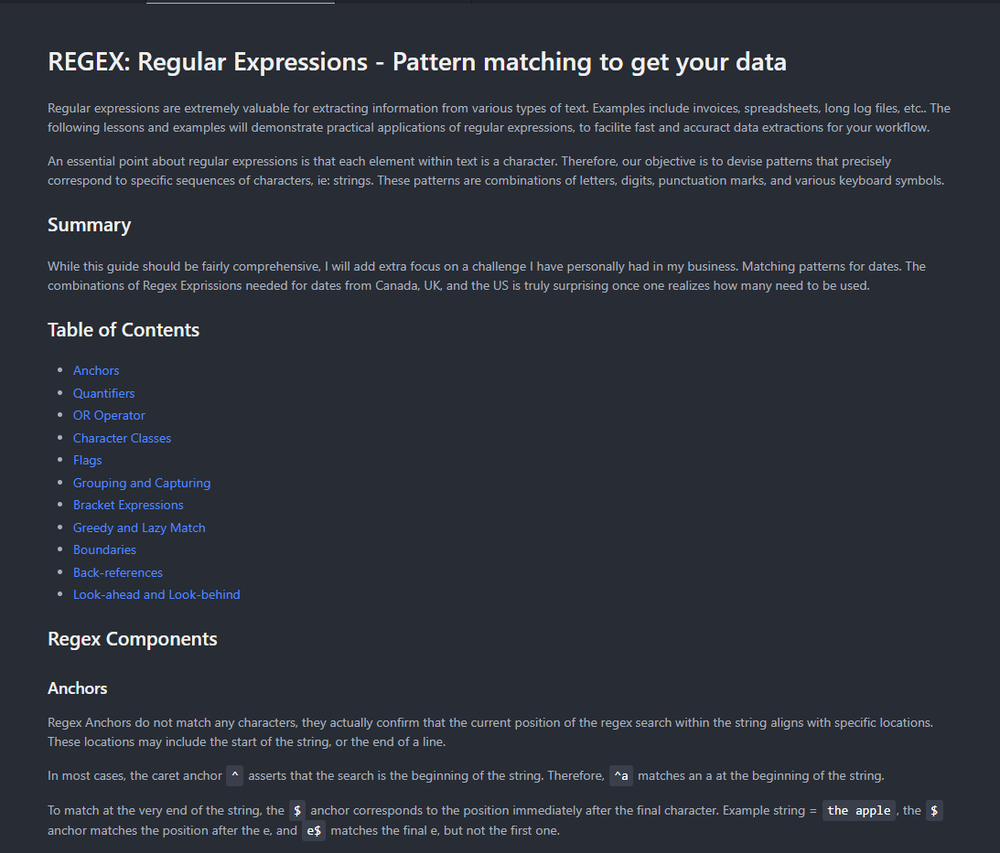

# Tech Blog

## Description

This is my first 'gist' or code snippet on github.  The purpose of this document is to have a fairly comprehensive overview of the fundamentals of Regex statements as a handy dandy reference.

## Table of Contents
- [Installation](#installation)
- [Usage](#usage)
- [License](#license)
- [Contributing](#contributing)
- [Tests](#tests)
- [Questions](#questions)
- [Screenshots](#screenshots)
- [Demonstration Video](#video)
- [GitHub Link](#github-link)

## Installation
1. "**Node.js**" must be installed on local machine.
2. Once in your project folder please type "**npm i -y**" for all dependencies.

## Usage
Clone the repository to your local machine.
git clone https://github.com/harrymac1972/tech_blog.git
Navigate to the project directory.
cd tech-blog
Install the required dependencies.
npm install

## License
This application is licensed by: [MIT](https://opensource.org/licenses/MIT)

## Contributing
You may 'fork' the project in the github repository.

## Tests
n/a

## Questions
If you have any questions, please contact:
-- (https://github.com/harrymac1972)
-- harrymac1972@gmail.com.

## Screenshots

## Demonstration Video
n/a

## GitHub Link
<a href="https://github.com/harrymac1972/regex_tut">Regex Tutorial on Github</a>

## Heroku Link
n/a